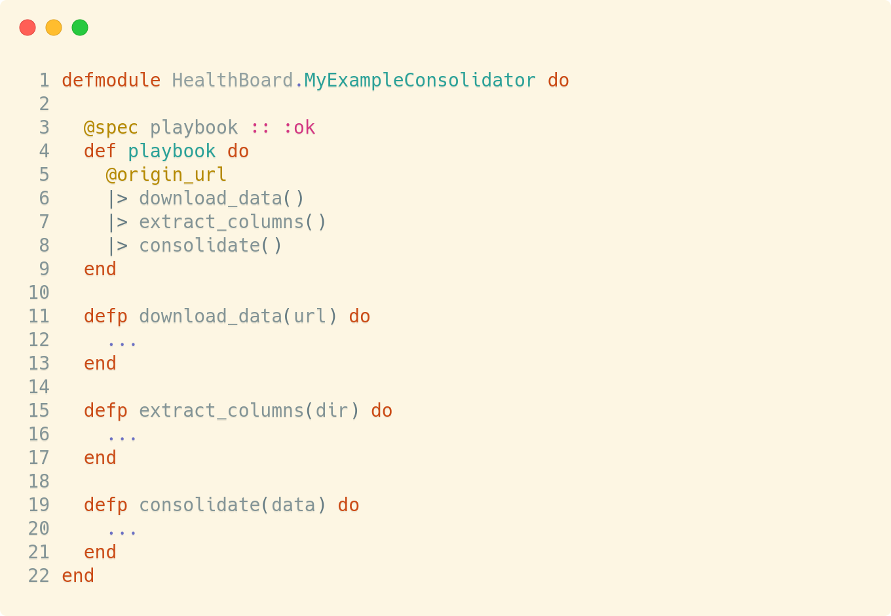
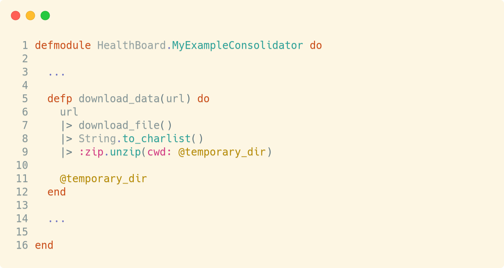
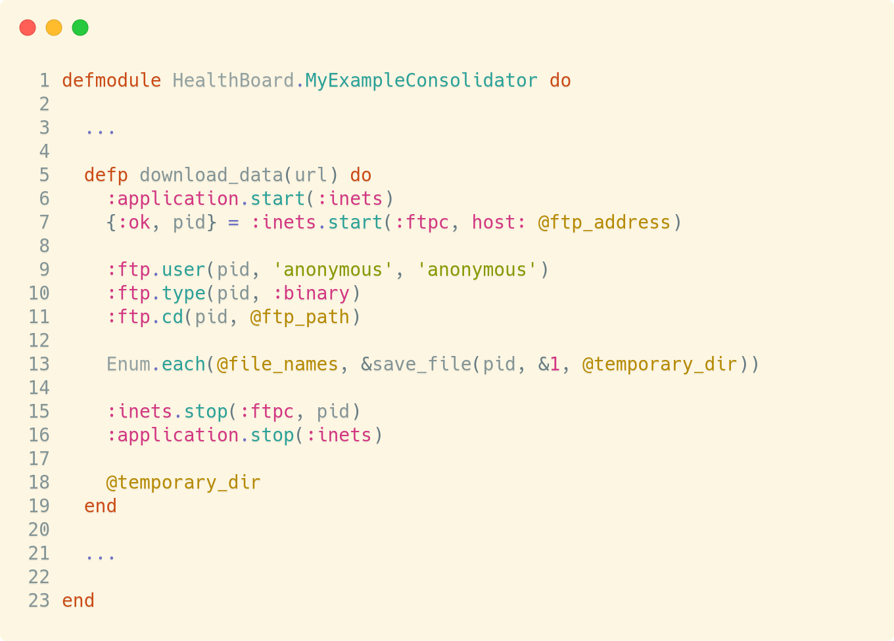
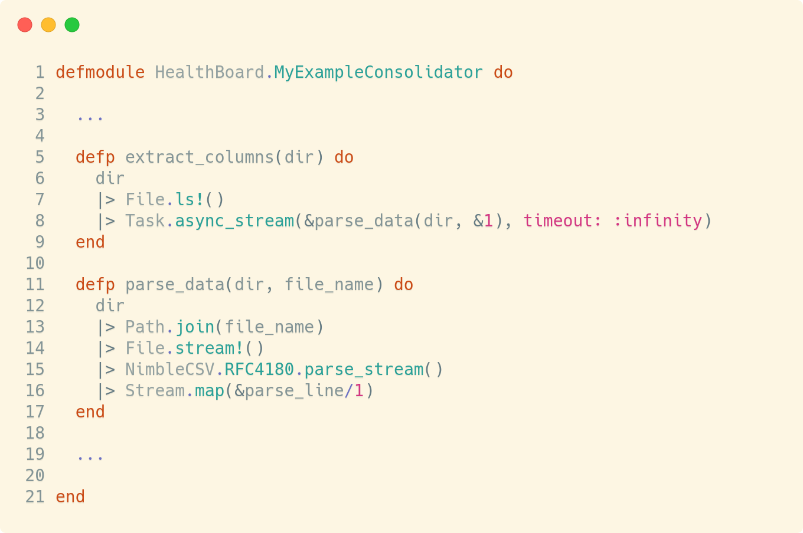
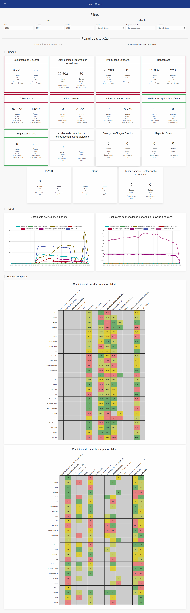

# HealthBoard - Documento Técnico

## 1. Informações gerais

HealthBoard é um sistema de painéis descritivos e analíticos de situação de saúde.

Tal sistema objetiva, inicialmente, captar informações consolidadas de dados abertos de saúde do Brasil sobre doenças, agravos e eventos de saúde pública de notificação compulsória (conforme portaria Nº 1.061, de 18 de Maio de 2020 do Diário Oficial da União) e apresentá-las em painéis de situação para utilização ampla no Ministério da Saúde e nas Secretarias Municipais e Estaduais de Saúde.

Para definição dos dados para o HealthBoard, faz-se necessário realizar o seguinte processo de desenvolvimento:

- Mapear as bases de dados abertos e a origem de seus dados;

- Identificar os indicadores de relevância em cada base de dados abertos para cada contexto de dados;

- Extrair os dados relevantes para os indicadores das bases de dados abertos;

- Gerar indicadores a partir dos dados relevantes, agrupados de acordo com a hierarquia de localidades do Brasil;

- Inserir dados dos indicadores em um banco de dados PostgreSQL;

- Definir camadas de acesso (_backend_) no HealthBoard para os indicadores, e;

- Definir painéis (_frontend_) no HealthBoard dos indicadores, agrupados em seus respectivos contextos.

Tal processo foi realizado para as seguintes bases de dados abertos:

- **População DATASUS**: Para aquisição de indicadores demográficos de população residente;

- **SINASC**: Para aquisição de indicadores de nascidos vivos;

- **SINAN**: Para aquisição de indicadores de doenças, agravos e eventos de saúde pública de notificação compulsória;

- **SIM**: Para aquisição de indicadores de mortalidade de doenças, agravos e eventos de saúde pública de notificação compulsória, e;

- **SIPNI**: Para aquisição de indicadoroes de cobertura vacinal e imunização de doenças de notificação compulsória.

Este documento apresenta:

- A arquitetura típica de um módulo típico de consolidação de dados abertos;

- A arquitetura do sistema HealthBoard, e;

- Resultados obtidos.

## 2. Arquitetura de módulo típico de consolidação

Os exemplos das figuras desta seção estão simplificadas para fins de facilitar a compreensão do módulo e suas funções.

Um módulo típico de consolidação realiza três macro-operações, a partir de uma fonte, conforme figura abaixo:

<!-- markdownlint-disable MD033 -->

<!-- markdownlint-enable MD033 -->

> Figura 1 - Corpo de um módulo típico de consolidação.

### 2.1. Operação de extração de dados

Os dados abertos do Brasil são variados e sem uma estrutura conveniente para extração homogênea de informações.

Devido a isso, até o presente momento encontramos 3 tipos distintos para acesso e extração dos dados abertos:

1. Através do TABNET, ou de uma interface do TABNET no _website_ do DATASUS;

2. Através de um endereço _web_ para arquivo(s) compactado(s);

3. Através do FTP do DATASUS.

Destes três tipos, a extração via TABNET é a única que não é possível de realização dentro de um módulo típico de consolidação.

Para um arquivo compactado, a função de extração de dados (`&download_data/1`) recebe um endereço único, realiza o download do arquivo, descompacta e salva em uma pasta temporária, conforme figura abaixo:

<!-- markdownlint-disable MD033 -->

<!-- markdownlint-enable MD033 -->

> Figura 2 - Corpo de uma função típica de download de arquivo compactado.

Através de um FTP, a função de extração de dados recebe um endereço único, realiza o download de todos os arquivos desejados contidos neste endereço e salva em uma pasta temporária, conforme figura abaixo:

<!-- markdownlint-disable MD033 -->

<!-- markdownlint-enable MD033 -->

> Figura 3 - Corpo de uma função típica de download de arquivo em uma base FTP.

Há casos em que os arquivos precisam ser coletados de diferentes origens. Para tanto, basta atualizar a função para receber de diferentes origens.

### 2.2. - Operação de extração de colunas

Com os dados contidos em um diretório de arquivos local, é possível realizar o _parsing_ dos dados de cada arquivo, resultando em um arquivo onde cada linha é um registro único e cada coluna é um indicador de interesse.

Para arquivos `.dbf` ou `.dbc`, se faz necessário converter para `.csv`. Para tanto, criamos uma imagem Docker para realizar tal operação de conversão e está disponível no endereço: <https://hub.docker.com/r/pydemic/dbc2csv>.

Para pouco volume de dados, basta percorrer as linhas dos arquivos e realizar o _parsing_. Entretanto, para grandes volumes de arquivos, se faz necessário utilizar de algoritmos que permitam a distribuição da operação de _parsing_ de forma paralela e/ou com uso de armazenamento em disco.

Na figura abaixo é descrito um exemplo de implementação de extração de colunas para um volume médio de dados:

<!-- markdownlint-disable MD033 -->

<!-- markdownlint-enable MD033 -->

> Figura 4 - Corpo de uma função típica extração de colunas.

### 2.3. - Operação de consolidação

Para consolidar, se faz necessário mapear os valores de cada registro em, pelo menos, nas dimensões de tempo e local.

Por padrão, a dimensão de local é definida de acordo com os seguintes níveis:

- Nacional (ex: Brasil)
- Regional (ex: Nordeste)
- Estadual (ex: Bahia)
- Regional de Saúde (ex: Valença)
- Municipal (ex: Ituberá)

Uma excelente abordagem para consolidar na dimensão de local é através do _MapReduce_ onde o _mapping_ estabelece a árvore de indicadores para todos os registros de municípios e o _reduce_ borbulha (_bubble up_) na árvore consolidando os valores em cada nível de local.

Para a dimensão de tempo, é possível definir os níveis em camadas de relevância para os indicadores. Por exemplo:

- Para registros de nascidos vivos, se fez necessário apenas o nível "anual";

- Para registros de morbidades, se fez necessário os nívels "anual" e "semanal";

- Para registros ambientes, fará necessário os níveis "anual", "semenal" e "diário".

Outras dimensões identificadas:

- Doença, agravo ou evento de saúde pública de notificação compulsória;
- Local de registro da ocorrência, de contaminação e de residência.

### 2.4. - Resultados obtidos: Resumo de consolidações realizadas

As seguintes consolidações foram realizadas:

- **Nascidos vivos**:

  - **Base**: SINASC

  - **Volume de dados**: 1-10 GB

  - **Indicadores**:

    - Idade materna

    - Duração da gestação

    - Quantidade de consultas prenatal

    - Local de parto

    - Tipo de parto

    - Sexo do nascido vivo

    - Peso do nascido vivo

  - **Dimensões de consolidação**:

    - Ano

    - Local

- **Morbidade**:

  - **Base**: SINAN

  - **Volume de dados**: 1-10 GB

  - **Indicadores**:

    - Sexo/Idade

    - Raça/Cor

    - Classificação do caso

    - Evolução do caso

    - Indicadores adicionais específicos de cada morbidade

  - **Dimensões de consolidação**:

    - Ano

    - Semana

    - Doença, agravo ou evento de notificação compulsória

    - Local

- **Óbitos**:

  - **Base**: SIM

  - **Volume de dados**: 1-10 GB

  - **Indicadores**:

    - Sexo/Idade

    - Raça/Cor

    - Tipo de óbito

    - Investigação

  - **Dimensões de consolidação**:

    - Ano

    - Semana

    - Doença, agravo ou evento de notificação compulsória

    - Local

## 3, Arquitetura do HealthBoard

HealthBoard é um projeto típico do _framework_ Phoenix, com estrutura semelhante ao do projeto ASIS:

- O _backend_ comunica com o banco de dados e realiza operação de leitura e escrita;

- O _frontend_ comunica com o _backend_ e apresenta os dados em paíneis.

O _frontend_ foi desenvolvido utilizando de Phoenix LiveViews, que possui alta performance com comunicação em tempo real entre cliente e servidor através de _websockets_.

Os componentes foram implementados através do uso da biblioteca Surface.

Os gráficos foram renderizados através do uso da biblioteca ChartJS.

Os mapas foram renderizados através do uso da biblioteca Leaflet.

### 3.1 Estrutura de arquivos

Os arquivos são divididos em dois diretórios:

```
.
├── health_board
│   ├── application.ex
│   ├── contexts
│   ├── contexts.ex
│   ├── release
│   └── repo.ex
├── health_board.ex
├── health_board_web
│   ├── cldr.ex
│   ├── controllers
│   ├── endpoint.ex
│   ├── gettext.ex
│   ├── helpers
│   ├── live
│   ├── router.ex
│   ├── templates
│   └── views
└── health_board_web.ex
```

- `health_board` - O _backend_ do projeto;

- `health_board_web` - O _frontend_ do projeto.

### 3.1.1. O _backend_

Em `health_board`, os contextos definem os variados contextos de informação que o HealthBoard utiliza no projeto:

```
.
├── managers
│   ├── demographic
│   │   ├── yearly_births.ex
│   │   └── yearly_populations.ex
│   ├── geo
│   │   └── locations.ex
│   ├── info
│   │   ├── dashboards.ex
│   │   └── data_periods.ex
│   ├── morbidities
│   │   ├── weekly_morbidities.ex
│   │   └── yearly_morbidities_cases.ex
│   └── mortalities
│       ├── weekly_deaths.ex
│       └── yearly_deaths.ex
└── schemas
    ├── demographic
    │   ├── year_births.ex
    │   └── year_population.ex
    ├── geo
    │   └── location.ex
    ├── info
    │   ├── card.ex
    │   ├── dashboard.ex
    │   ├── data_period.ex
    │   ├── group.ex
    │   ├── indicator_child.ex
    │   ├── indicator.ex
    │   ├── indicator_source.ex
    │   ├── section_card.ex
    │   ├── section_card_filter.ex
    │   ├── section.ex
    │   └── source.ex
    ├── morbidities
    │   ├── week_morbidity.ex
    │   └── year_morbidity.ex
    └── mortalities
        ├── week_deaths.ex
        └── year_deaths.ex
```

- `managers` - Responsáveis por disponibilizar funções públicas de leitura e escritas de dados;

- `schemas` - Definições estruturais dos dados.

Foram definidos os seguintes `schemas`:

- `YearBirths` - Consolidação de registros de nascidos vivos por local e ano;

- `YearPopulation` - População residente de um local em um determinado ano;

- `Location` - Definição de um local (País, região, UF, regional de saúde e município);

- `Card` - Informações de representação visual de um indicador;

- `Dashboard` - Informações de um painel;

- `DataPeriod` - Informações de datas de primeiro e último registros de um contexto de dados;

- `Group` - Informações de um grupo de seções de um determinado painel;

- `IndicatorChild` - Relacionamento entre um indicador e outro indicador;

- `Indicator` - Informações de um indicador;

- `IndicatorSource` - Relacionamento entre um indicador e uma fonte de dados;

- `SectionCard` - Definição de um cartão para uma determinada seção;

- `SectionCardFilter` - Definição de um filtro para um determinado cartão de uma seção;

- `Section` - Definição de uma seção em um grupo de um painel;

- `Source` - Definição de uma fonte de dados;

- `WeekMorbidity` - Consolidação de registros de morbidade por semana, doença/agravo e local;

- `YearMorbidity` - Consolidação de registros de morbidade por ano, doença/agravo e local;

- `WeekDeaths` - Consolidação de registros de mortalidade por semana, doença/agravo e local;

- `YearDeaths` - Consolidação de registros de mortalidade por ano, doença/agravo e local;

### 3.1.2. O _frontend_

Em `health_board_web`, as páginas LiveView são definidas no diretório `live/live_views`:

```
.
├── dashboard_live
│   ├── data
│   │   ├── card_data
│   │   ├── card_data.ex
│   │   ├── common_data.ex
│   │   ├── dashboard_data
│   │   ├── dashboard_data.ex
│   │   ├── event_data.ex
│   │   ├── group_data.ex
│   │   └── section_data.ex
│   ├── data_manager.ex
│   ├── event_manager.ex
│   ├── fragments
│   │   ├── analytic_dashboard
│   │   ├── analytic_dashboard.ex
│   │   ├── demographic_dashboard.ex
│   │   ├── morbidity_dashboard
│   │   ├── morbidity_dashboard.ex
│   │   └── no_dashboard.ex
│   └── info_manager.ex
└── dashboard_live.ex
```

Um painel é renderizado de acordo com o código definido em `dashboard_live.ex` e no diretório `fragments`.

Os dados são mapeados de acordo com o código definido em `dashboard_live.ex` e no diretório `data`.

## 3.2. Resultados obtidos: Painel analítico

<!-- markdownlint-disable MD033 -->

</img>

<!-- markdownlint-enable MD033 -->

> Figura 5 - Visão geral do painel analítico.
